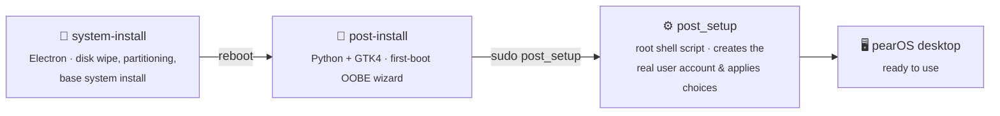

<div align="center">

# 🍐 pearOS Installer

**A two-stage installer for pearOS — from bare disk to a fully personalized, first-boot-ready desktop.**


</div>

<br>

> [!WARNING]
> **`system-install` erases the entire target disk.** The moment you press **Continue**, every partition on the selected drive is wiped — there is no undo. This project is still a work in progress; things can and do break.

<br>

## What is this?

pearOS Installer is made of two independent apps that hand off to each other, mirroring the shape of a real desktop OS installer:



| Stage | Tech | Job |
|---|---|---|
| **`system-install/`** | Electron | Partitions the disk, installs the base Debian + pearOS system |
| **`post-install/`** | Python 3 + GTK4 | First-boot setup wizard — language, account, and personalization, macOS Setup Assistant-style |

<br>

## 👋 `post-install` — the first-boot wizard

This is where most of the recent work has gone: a full rewrite from Electron/Node to native **Python + GTK4**, pixel-matched against the original design, with the flow expanded to mirror macOS's own Setup Assistant end to end.

<details open>
<summary><strong>✨ The opening moment</strong></summary>
<br>

The wizard opens on a hand-drawn "hello" wordmark, rendered with a real-time **GPU fragment shader** (`Gsk.GLShader`) that refracts and chromatically-aberrates the actual desktop wallpaper *through* the letters — not a static image, a live glass-like material lit from above. The camera opens tight on the first letter and pulls back into the full word as it's written. If the shader can't compile on a given machine, the page falls back to a flat animated stroke automatically — same choreography, no crash, no blank screen.

</details>

<details>
<summary><strong>🗺️ A full Setup Assistant flow</strong></summary>
<br>

Language → Country/Region → Written & Spoken Languages → Keyboard → Time Zone → Accessibility → Wi-Fi → Data & Privacy → Migration Assistant → PearID sign-in → Terms & Conditions → Create a Computer Account → Choose Your Look → Location Services → Analytics → Screen Time → Piri → Touch ID → Finish.

Every screen talks to the *real* system underneath it — nothing here is a mockup:

- 📶 **Wi-Fi** — live scan & connect via `nmcli`
- 🆔 **PearID** — the actual sign-in scripts against `account.pearos.xyz`
- 👆 **Touch ID** — real enrollment via `fprintd`, with a custom live fingerprint-scan animation
- ♿ **Accessibility** — sticky/slow/bounce/mouse keys, contrast, reduced motion — real Plasma/XKB controls
- ⏱️ **Screen Time**, 📊 **Analytics**, 🐦 **Piri** — wired into the real pearOS `system-settings` backends

</details>

<details>
<summary><strong>🏗️ The tricky part: it runs before your account exists</strong></summary>
<br>

The wizard runs as a temporary live user, *before* your actual account is created — `useradd` only happens afterward, in `post_setup` (a root shell script). Anything that looks like it's "applying a setting" during the wizard (a theme, an accessibility toggle, a fingerprint enrollment, a PearID session) is really just recording your *choice*; `post_setup` is what applies it to your real account once it exists — migrating fingerprint data, re-scheduling first-login scripts for anything that needs a live desktop session, and so on. Nothing you configure during setup gets silently lost when the temporary account is cleaned up on first real login.

</details>

<details>
<summary><strong>🩹 If something goes wrong</strong></summary>
<br>

A failed `post_setup` run doesn't just dump a wall of text. The log is uploaded (best-effort, and scrubbed of your password/username/hostname first) to a plain-text paste host, and a **QR code** pointing at it is shown on screen — scan it, and drop the link into a GitHub issue, the pearOS Discord, or r/pearos. No internet? The log itself gets encoded directly into the QR code instead, no upload required.

</details>

<br>

## 💽 `system-install` — the disk installer

The Electron-based frontend that does the heavy lifting: wipes and partitions the selected disk, lays down the base Debian + pearOS system, and hands off to `post-install` on first boot. Looks and feels a lot like macOS's own installer.

<br>

## 🚀 Running it

```sh
# Disk installer (⚠️ will erase the selected disk)
cd system-install
make

# First-boot wizard
cd post-install
make
```

`post-install` also supports a safe dry run that skips the real `post_setup` invocation entirely:

```sh
POST_INSTALL_TEST=1 python3 -m gtkapp
```

<br>

## 🙌 Contributors

- **zhovner** — base of the UI, originally made in Electron. Heavily modified since; not even 10% of the original code is still present, but *someone* wants me to mention that xd
- **[@jorgeluiscarrillo](https://github.com/jorgeluiscarrillo)** — the install script. Extremely modified — only the coding structure was borrowed — but *someone* can still report this as "stolen code" :)
